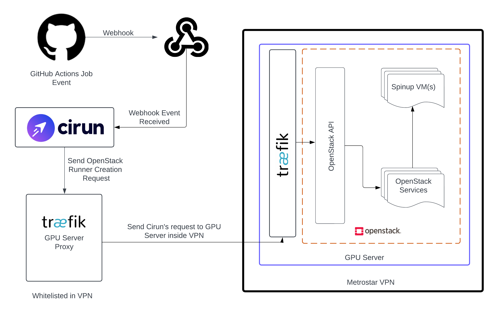

# Setup overview

* The server runs OpenStack, which is able to spin up VMs on demand. See [`openstack.md`](./openstack.md) for more information.
* The VMs run images built with [diskimage-builder](https://docs.openstack.org/diskimage-builder/latest/). See [`images.md`](./images.md) for more information.
* Cirun knows how to connect to OpenStack to spin up VMs and expose them to Github Actions as self-hosted runners. See [`cirun.md`](./cirun.md) for more information.
* The server is behind a VPN, which prevents public access to the server. See [`network.md`](./network.md) for more information.
